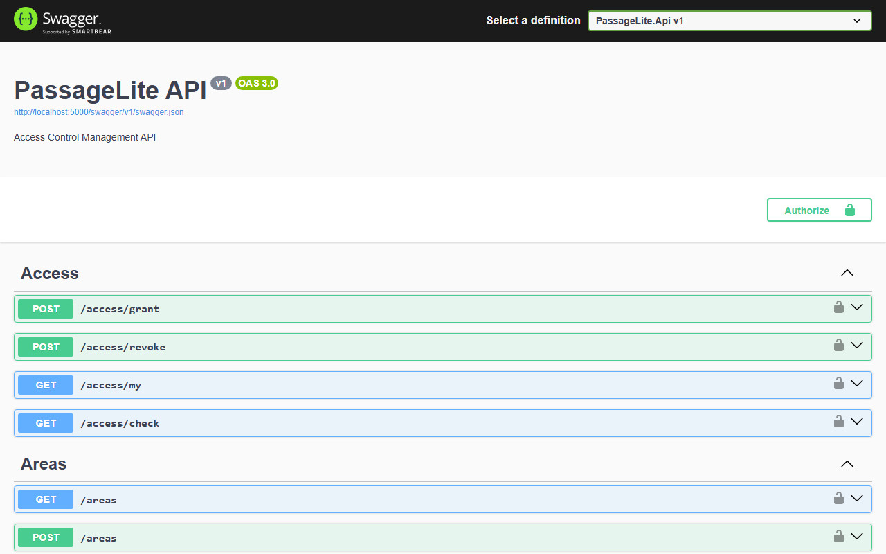
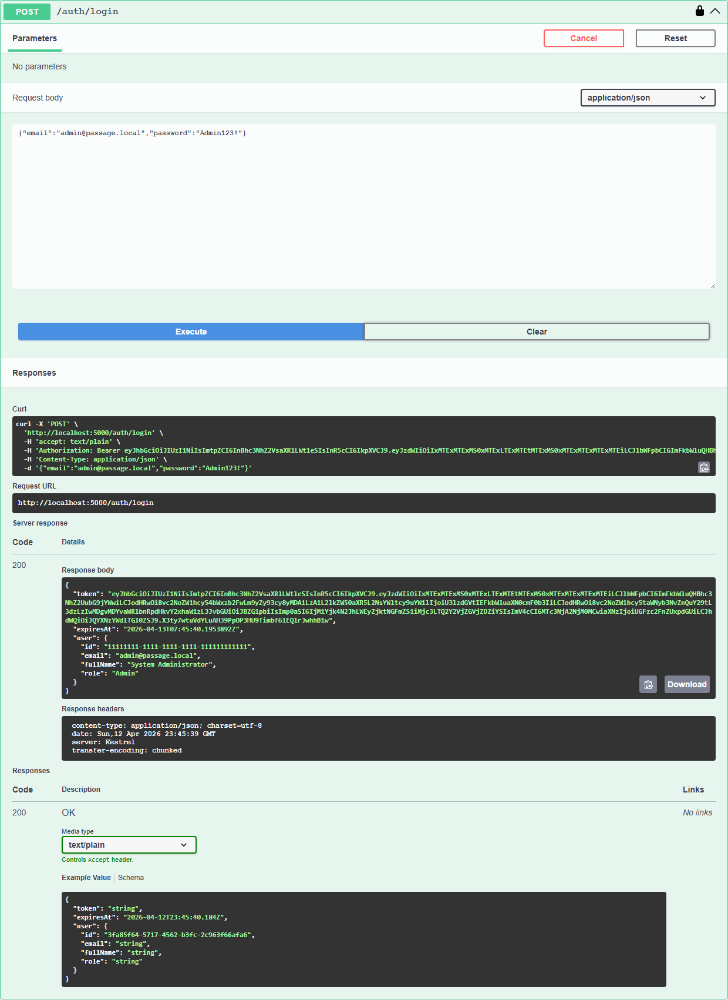
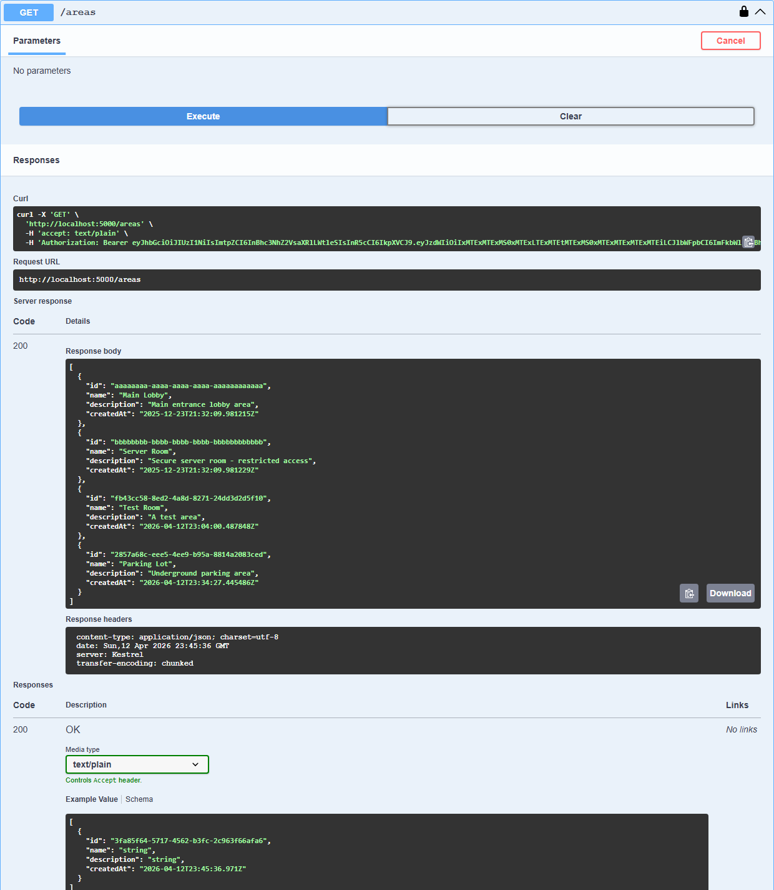

# PassageLite

A minimal but professional Access Control Management API demonstrating .NET 8 best practices with JWT authentication, multi-database support, CI/CD, and cloud deployment to Azure.

**Live API:** https://passagelite-api.azurewebsites.net/health

## Context

> **Portfolio/Learning Project**  
> This project was built as a personal portfolio piece to demonstrate proficiency with .NET 8 Web API, Entity Framework Core, JWT authentication, Docker containerization, and Azure cloud deployment. It is not built for or affiliated with any employer.  
> **Built: December 2025 — Deployed to Azure: July 2026**

## Tech Stack

- **.NET 8** - Latest LTS version
- **ASP.NET Core Web API** - RESTful API framework
- **Entity Framework Core 8** - ORM with code-first migrations, supports PostgreSQL and SQL Server
- **PostgreSQL** (Supabase) - Production database
- **SQL Server** - Alternate provider, verified via CI service container
- **JWT Bearer Authentication** - Secure token-based auth with role support
- **Serilog** - Structured logging with request logging
- **xUnit** - Unit and integration testing
- **Docker & Docker Compose** - Containerization
- **GitHub Actions** - CI/CD pipeline (build, test, deploy)
- **Azure App Service** - Cloud hosting (France Central, F1 free tier)

## Project Structure

```
PassageLite/
├── src/
│   ├── PassageLite.Api/           # Web API, Controllers, Program.cs
│   ├── PassageLite.Application/   # Services, DTOs, Interfaces
│   ├── PassageLite.Domain/        # Entities, Domain Interfaces
│   └── PassageLite.Infrastructure/# EF Core, Repositories, Data
├── tests/
│   └── PassageLite.Tests/         # Unit & Integration Tests
├── Dockerfile
├── docker-compose.yml
└── README.md
```

## CI/CD & Deployment

The GitHub Actions workflow (`.github/workflows/azure-deploy.yml`) runs on every push to `main` or `azure-sqlserver` and has three jobs:

| Job | What it does |
|-----|-------------|
| `build-and-test` | Restores, builds, runs all unit/integration tests, publishes artifact |
| `test-sqlserver` | Spins up a real SQL Server 2022 container and runs `SqlServerProviderTests` against it |
| `deploy` | Deploys the published artifact to Azure App Service (requires both jobs to pass) |

The live API is deployed at: **https://passagelite-api.azurewebsites.net**

## Quick Start with Docker

```bash
# Clone the repository
git clone <repository-url>
cd PassageLite

# Start with Docker Compose
docker compose up --build

# API will be available at http://localhost:5000
# Swagger UI at http://localhost:5000/swagger
```

## Local Development

### Prerequisites
- .NET 8 SDK
- PostgreSQL 16 (or use Docker)
- Docker (optional)

### Running Locally

```bash
# Start PostgreSQL with Docker (if not installed locally)
docker run -d --name passagelite-db \
  -e POSTGRES_USER=postgres \
  -e POSTGRES_PASSWORD=postgres \
  -e POSTGRES_DB=passagelite \
  -p 5432:5432 \
  postgres:16-alpine

# Restore dependencies
dotnet restore

# Build the solution
dotnet build

# Run tests
dotnet test

# Run the API
cd src/PassageLite.Api
dotnet run
```

The API will be available at `http://localhost:5000` (Docker) or `http://localhost:5xxx` (local development).

### Migrations

Migrations are applied automatically on startup in Development mode. To manually manage migrations:

```bash
# Add a new migration
cd src/PassageLite.Api
dotnet ef migrations add <MigrationName> -p ../PassageLite.Infrastructure -o Data/Migrations

# Apply migrations manually
dotnet ef database update -p ../PassageLite.Infrastructure
```

## Seeded Demo Credentials

| Role  | Email                 | Password    |
|-------|-----------------------|-------------|
| Admin | admin@passage.local   | Admin123!   |
| User  | user@passage.local    | User123!    |

### Seeded Areas

| Name        | Description                          |
|-------------|--------------------------------------|
| Main Lobby  | Main entrance lobby area             |
| Server Room | Secure server room - restricted access |

## API Endpoints

### Authentication

| Method | Endpoint     | Description              | Auth Required |
|--------|--------------|--------------------------|---------------|
| POST   | /auth/login  | Get JWT token            | No            |
| GET    | /auth/me     | Get current user info    | Yes           |

### Areas

| Method | Endpoint | Description       | Auth Required |
|--------|----------|-------------------|---------------|
| GET    | /areas   | List all areas    | Yes           |
| POST   | /areas   | Create new area   | Admin only    |

### Access Control

| Method | Endpoint       | Description                 | Auth Required |
|--------|----------------|-----------------------------|---------------|
| POST   | /access/grant  | Grant access to user        | Admin only    |
| POST   | /access/revoke | Revoke access from user     | Admin only    |
| GET    | /access/my     | List current user's grants  | Yes           |
| GET    | /access/check  | Check access to an area     | Yes           |

### Health

| Method | Endpoint | Description        | Auth Required |
|--------|----------|--------------------|---------------|
| GET    | /health  | Health check       | No            |

## Example Requests (curl)

### Login as Admin

```bash
curl -X POST http://localhost:5000/auth/login \
  -H "Content-Type: application/json" \
  -d '{"email": "admin@passage.local", "password": "Admin123!"}'
```

Response:
```json
{
  "token": "eyJhbGciOiJIUzI1NiIs...",
  "expiresAt": "2026-01-15T12:00:00Z",
  "user": {
    "id": "11111111-1111-1111-1111-111111111111",
    "email": "admin@passage.local",
    "fullName": "System Administrator",
    "role": "Admin"
  }
}
```

### Get Current User

```bash
curl http://localhost:5000/auth/me \
  -H "Authorization: Bearer <your-jwt-token>"
```

### List Areas

```bash
curl http://localhost:5000/areas \
  -H "Authorization: Bearer <your-jwt-token>"
```

### Create Area (Admin only)

```bash
curl -X POST http://localhost:5000/areas \
  -H "Authorization: Bearer <admin-jwt-token>" \
  -H "Content-Type: application/json" \
  -d '{"name": "Parking Garage", "description": "Underground parking"}'
```

### Grant Access (Admin only)

```bash
curl -X POST http://localhost:5000/access/grant \
  -H "Authorization: Bearer <admin-jwt-token>" \
  -H "Content-Type: application/json" \
  -d '{
    "userId": "22222222-2222-2222-2222-222222222222",
    "areaId": "aaaaaaaa-aaaa-aaaa-aaaa-aaaaaaaaaaaa",
    "validFrom": "2026-01-01T00:00:00Z",
    "validTo": "2026-12-31T23:59:59Z"
  }'
```

### Revoke Access (Admin only)

```bash
curl -X POST http://localhost:5000/access/revoke \
  -H "Authorization: Bearer <admin-jwt-token>" \
  -H "Content-Type: application/json" \
  -d '{
    "userId": "22222222-2222-2222-2222-222222222222",
    "areaId": "aaaaaaaa-aaaa-aaaa-aaaa-aaaaaaaaaaaa"
  }'
```

### Get My Access Grants

```bash
curl http://localhost:5000/access/my \
  -H "Authorization: Bearer <your-jwt-token>"
```

### Check Access to Area

```bash
curl "http://localhost:5000/access/check?areaId=aaaaaaaa-aaaa-aaaa-aaaa-aaaaaaaaaaaa" \
  -H "Authorization: Bearer <your-jwt-token>"
```

Response:
```json
{
  "hasAccess": true,
  "reason": "Access granted to Main Lobby"
}
```

### Health Check

```bash
curl http://localhost:5000/health
```

## Running Tests

```bash
# Run all tests
dotnet test

# Run with verbose output
dotnet test --verbosity normal

# Run with coverage
dotnet test --collect:"XPlat Code Coverage"
```

### Test Coverage

The test project includes:

1. **Unit Tests** (`AccessServiceTests.cs`)
   - Access check returns true when grant is valid
   - Access check returns false when grant is expired
   - Access check returns false when grant is revoked
   - Access check returns false when no grant exists
   - Access check returns false when grant not yet valid
   - Grant access creates new grant
   - Revoke access revokes existing grant

2. **Integration Tests** (`IntegrationTests.cs`)
   - Health endpoint returns OK
   - Login with valid credentials returns token
   - Login with invalid credentials returns Unauthorized
   - Protected endpoints require authentication
   - Admin-only endpoints reject non-admin (403 Forbidden)
   - User info endpoint returns correct data

3. **SQL Server Provider Tests** (`SqlServerProviderTests.cs`)
   - Schema creation and user write/read against real SQL Server
   - Unique email constraint enforcement
   - Area and AccessGrant with eager-loaded relationships
   - Skipped automatically when `PASSAGELITE_SQLSERVER_TEST_CONNECTION` is not set (CI provides it via service container)

## Configuration

Configuration is managed via `appsettings.json` and environment variables:

| Setting | Environment Variable | Description |
|---------|---------------------|-------------|
| ConnectionStrings:DefaultConnection | ConnectionStrings__DefaultConnection | PostgreSQL connection string |
| Jwt:Secret | Jwt__Secret | JWT signing key (min 32 chars) |
| Jwt:Issuer | Jwt__Issuer | JWT issuer |
| Jwt:Audience | Jwt__Audience | JWT audience |
| Jwt:ExpirationMinutes | Jwt__ExpirationMinutes | Token expiration time |

## Screenshots

### Swagger UI — API Overview


### Login & JWT Token


### GET /areas — Protected Endpoint


## License

MIT License - See [LICENSE](LICENSE) for details.
